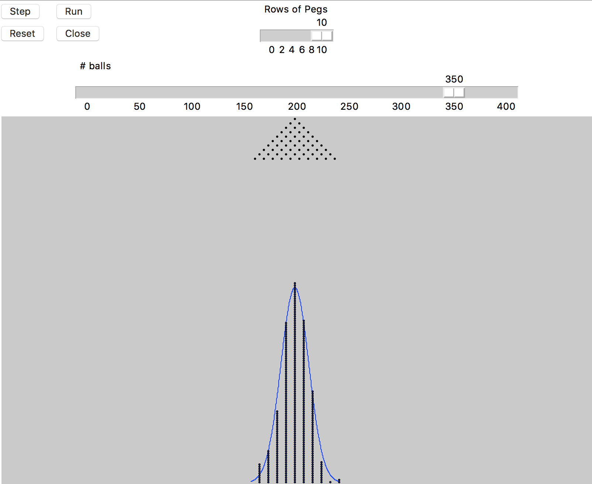

# Galton Board

## How to Run

Make sure you have Tkinter or tkinter installed. Change the import accordingly. (TODO: do this automatically)
~~~
python run.py
~~~

## Visualization
 

Parameters:
1. Number of rows of pegs
2. Number of balls to drop from the top of the screen

Controls:
1. Close: Closes the Game
2. Step: Steps through the game one step at a time
3. Run: Lets "gravity" take over until all balls have been dropped
4. Reset: Click this *after* changing parameters to reset the board
